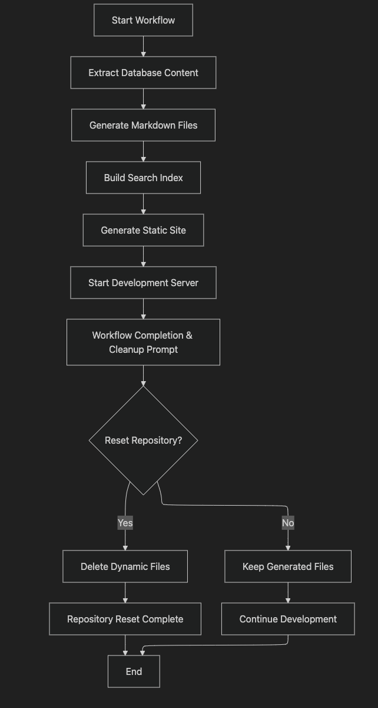

# AI Knowledge Hub MVP

> **🚧 Experimental Learning Project** - Simple tinkering with Cline and Notion MCP

This is a **minimal viable product (MVP)** built for experimentation and learning. The website is intentionally simple and not meant to be fancy - it's just for tinkering and exploring AI-assisted development workflows.

**Key Points:**

- **MVP Only**: Basic functionality to demonstrate concepts, not a polished product
- **Tinkering Project**: Built to experiment with tools and technologies
- **Workflow-Focused**: Designed to be run using automated development workflows
- **Learning Tool**: Created to explore AI-assisted development, not for production use

Extracts content from Notion databases and provides a basic searchable web interface. This project serves as an experimental MVP to demonstrate and learn about:

- **AI-Assisted Development**: Using Cline (AI coding assistant) for rapid prototyping
- **MCP Integration**: Exploring Model Context Protocol for AI-powered content enrichment
- **Notion API**: Building integrations with modern productivity tools
- **Modern Web Development**: Combining Astro, TypeScript, and Tailwind CSS

## Features

- **Notion Integration**: Automatically extracts pages from Notion databases and converts them to markdown
- **Full-Text Search**: Fast, fuzzy search through all knowledge content using Fuse.js
- **Modern UI**: Clean, responsive interface built with Tailwind CSS
- **Static Generation**: Fast loading with Astro's static site generation
- **AI-Ready**: Built-in support for Model Context Protocol (MCP) for AI enrichment
- **TypeScript**: Full TypeScript support for better development experience

## Technology Used

This project leverages a modern web development stack:

- **Astro**: Static site generator for fast, content-focused websites
- **TypeScript**: Type-safe JavaScript for better development experience
- **Tailwind CSS**: Utility-first CSS framework for rapid UI development
- **Fuse.js**: Lightweight fuzzy-search library for fast, relevant search results
- **Notion API**: Integration with Notion for content extraction and management
- **Model Context Protocol (MCP)**: Framework for AI-powered content enrichment
- **Node.js v22.9.0**: JavaScript runtime environment

## Learning Objectives

This MVP project was created to explore and demonstrate several key technologies and concepts:

### AI-Assisted Development with Cline

- **Rapid Prototyping**: How AI can accelerate development workflows
- **Code Generation**: Exploring AI's ability to generate functional code
- **Architecture Decisions**: AI-guided design patterns and best practices
- **Debugging & Optimization**: AI assistance in troubleshooting and performance tuning

### Model Context Protocol (MCP)

- **AI Integration Patterns**: Connecting AI models with external data sources
- **Content Enrichment**: Using AI to enhance and summarize knowledge content
- **Workflow Automation**: Building automated content processing pipelines
- **API Design**: Creating interfaces between AI systems and web applications

### Modern Web Development Stack

- **Astro Framework**: Static site generation and component-based architecture
- **TypeScript Integration**: Type safety in modern JavaScript development
- **API Integration**: Working with third-party APIs (Notion, MCP)
- **Performance Optimisation**: Building fast, efficient web applications

### Data Processing & Search

- **Content Extraction**: Converting structured data to web-friendly formats
- **Search Algorithms**: Implementing fuzzy search with Fuse.js
- **Data Indexing**: Building efficient search indexes for large datasets
- **Real-time Updates**: Synchronizing external data sources with web interfaces

## Development Workflow

This project is designed to be run using automated workflows rather than manual development:

1. **Automated Setup**: Use workflow scripts to set up the development environment
2. **Content Extraction**: Run automated scripts to pull content from Notion
3. **Build Process**: Use automated build pipelines for deployment
4. **AI-Assisted Development**: Leverage AI tools like Cline for rapid iteration

### MVP Workflow Overview



### Workflow Steps

1. **Extract Database Content**: Get all pages from the specified Notion database and save as JSON
2. **Generate Markdown Files**: Convert each page to markdown with frontmatter and save in `src/content/pages/`
3. **Build Search Index**: Create search index from all content and generate navigation structure
4. **Generate Static Site**: Build Astro pages with search functionality
5. **Start Development Server**: Run `npm run dev` to start server on port 3000
6. **Workflow Completion**: Prompt for cleanup decision
   - **Yes**: Delete all generated files and reset repository
   - **No**: Keep files for continued development

### Running the Workflow

```bash
/mvp
```

## Prerequisites

- Node.js v22.9.0 (use `nvm use v22.9.0` to switch versions)
- A Notion account with a database to extract from
- Notion API token

## Installation

1. Clone the repository:

```bash
git clone <repository-url>
cd ai-knowledge-hub-mvp
```

2. Install dependencies:

```bash
npm install
```

3. Set up environment variables:
Create a `.env` file in the root directory with:

```env
NOTION_TOKEN=your_notion_api_token
NOTION_DATABASE_ID=your_database_id
```

## 🔧 Configuration

### Notion Setup

1. Create a new integration in Notion:
   - Go to <https://www.notion.com/my-integrations>
   - Create a new integration
   - Copy the API token

2. Share your database with the integration:
   - Open your Notion database
   - Click "Share" and invite your integration

3. Get your database ID:
   - Your database ID is in the URL: `https://www.notion.so/your-workspace/database-id`

### Environment Variables

| Variable | Description | Required |
|----------|-------------|----------|
| `NOTION_TOKEN` | Your Notion API integration token | Yes |
| `NOTION_DATABASE_ID` | The ID of the Notion database to extract from | Yes |

## Project Structure

```
├── src/
│   ├── components/
│   │   ├── Search.astro          # Search component with Fuse.js
│   │   └── ...
│   ├── layouts/
│   │   └── Base.astro            # Main layout with Tailwind
│   ├── pages/
│   │   ├── index.astro           # Homepage with knowledge grid
│   │   ├── search.astro          # Dedicated search page
│   │   └── pages/
│   │       └── [slug].astro      # Dynamic page routing
│   └── content/
│       ├── _metadata.json        # Search index and page metadata
│       └── pages/                # Generated markdown files
├── scripts/
│   ├── extract-notion.js         # Notion extraction script
│   └── run-workflow.js           # Workflow automation
├── public/                       # Static assets
└── astro.config.mjs              # Astro configuration
```

### Content Structure

Each Notion page becomes a markdown file with:

- Frontmatter: title, description, date, excerpt
- Content: Full markdown conversion of Notion blocks
- Slug: URL-friendly identifier
